# Diagram Guide

Complete guide to creating technical diagrams using Mermaid syntax.

---

## Diagram Types Overview

| Type | Use Case | Complexity |
|------|----------|------------|
| Flowchart | Process flows, decision trees | Low |
| Sequence | Component interactions over time | Medium |
| Class | Object-oriented structure | Medium |
| State | State machines, transitions | Medium |
| ERD | Database schema | Medium |
| Gantt | Project timelines | Low |
| Git Graph | Git branch visualization | Low |
| Pie/Bar | Data visualization | Low |

---

## Flowchart (Graph) Diagrams

### Basic Syntax

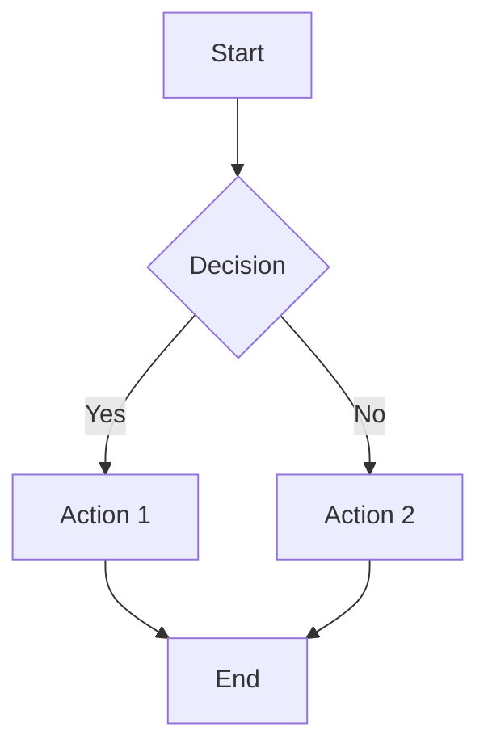
```mermaid
graph TD
    A[Start] --> B{Decision}
    B -->|Yes| C[Action 1]
    B -->|No| D[Action 2]
    C --> E[End]
    D --> E
```

### Node Shapes

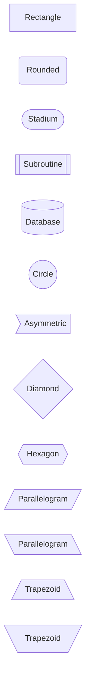
```mermaid
graph LR
    A[Rectangle]
    B(Rounded)
    C([Stadium])
    D[[Subroutine]]
    E[(Database)]
    F((Circle))
    G>Asymmetric]
    H{Diamond}
    I{{Hexagon}}
    J[/Parallelogram/]
    K[\Parallelogram\]
    L[/Trapezoid\]
    M[\Trapezoid/]
```

### Directionsions
- `graph TB` or `graph TD` - Top to Bottom
- `graph BT` - Bottom to Top
- `graph LR` - Left to Right
- `graph RL` - Right to Left

### Example: Deployment Process

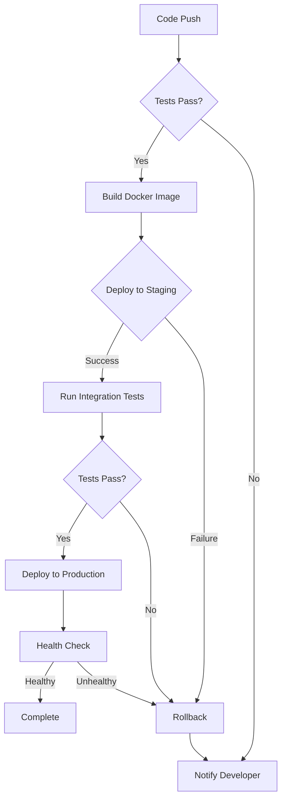
```mermaid
graph TD
    A[Code Push] --> B{Tests Pass?}
    B -->|Yes| C[Build Docker Image]
    B -->|No| D[Notify Developer]
    C --> E{Deploy to Staging}
    E -->|Success| F[Run Integration Tests]
    E -->|Failure| G[Rollback]
    F --> H{Tests Pass?}
    H -->|Yes| I[Deploy to Production]
    H -->|No| G
    I --> J[Health Check]
    J -->|Healthy| K[Complete]
    J -->|Unhealthy| G
    G --> D
```

### Example: System Architecture

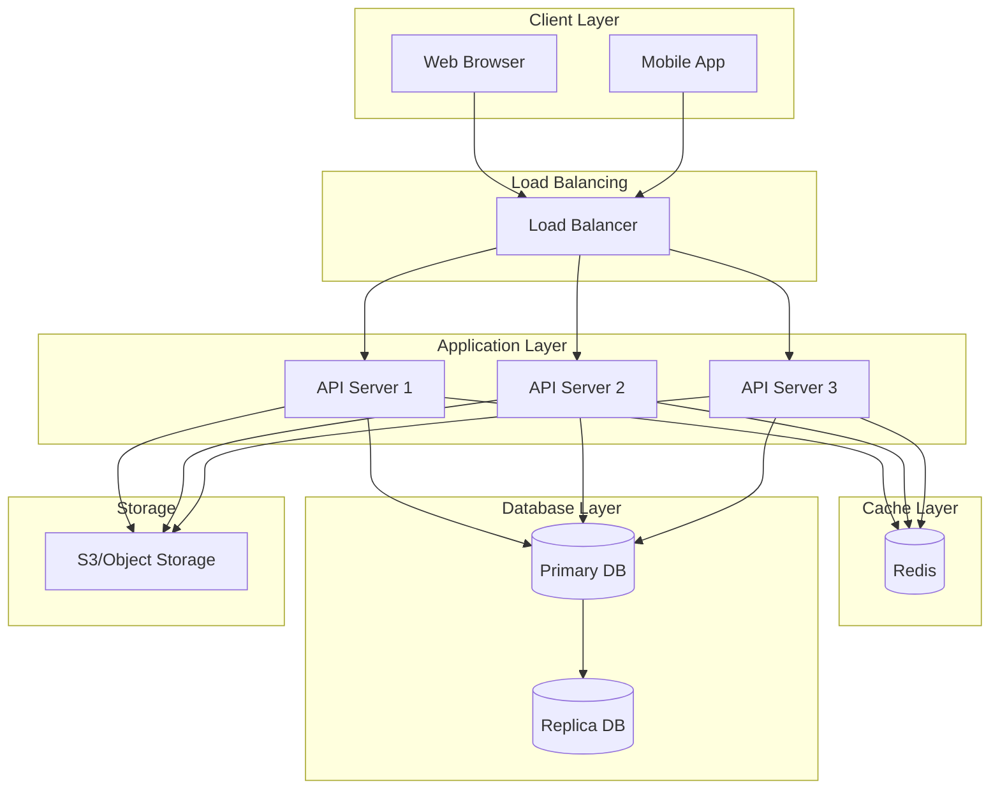
```mermaid
graph TB
    subgraph "Client Layer"
        A[Web Browser]
        B[Mobile App]
    end

    subgraph "Load Balancing"
        C[Load Balancer]
    end

    subgraph "Application Layer"
        D[API Server 1]
        E[API Server 2]
        F[API Server 3]
    end

    subgraph "Cache Layer"
        G[(Redis)]
    end

    subgraph "Database Layer"
        H[(Primary DB)]
        I[(Replica DB)]
    end

    subgraph "Storage"
        J[S3/Object Storage]
    end

    A --> C
    B --> C
    C --> D
    C --> E
    C --> F
    D --> G
    E --> G
    F --> G
    D --> H
    E --> H
    F --> H
    H --> I
    D --> J
    E --> J
    F --> J
```

---

## Sequence Diagrams

### Basic Syntax

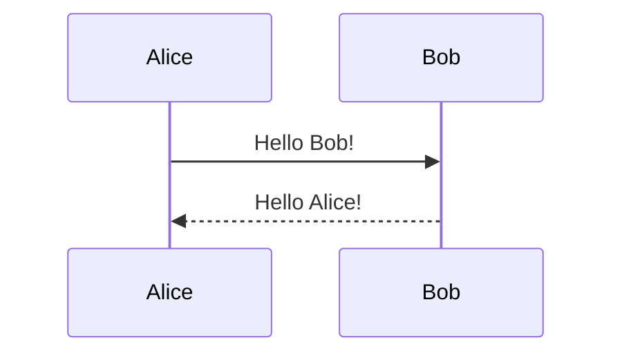
```mermaid
sequenceDiagram
    participant A as Alice
    participant B as Bob
    A->>B: Hello Bob!
    B-->>A: Hello Alice!
```

### Arrow Types
- `->` Solid line
- `-->` Dashed line
- `->>` Solid arrow
- `-->>` Dashed arrow
- `-x` Solid cross
- `--x` Dashed cross

### Example: Authentication Flow

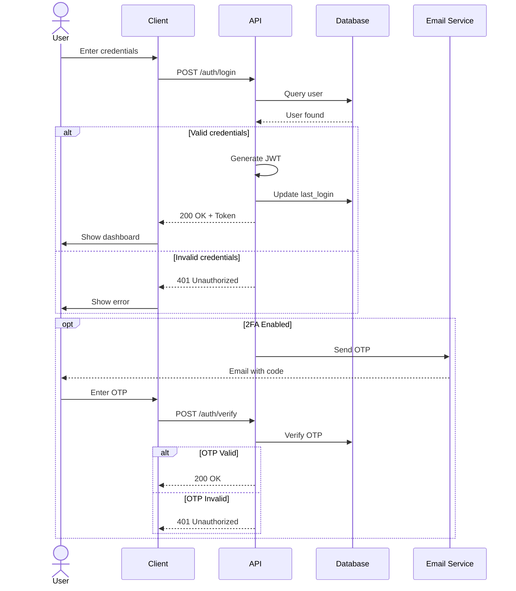
```mermaid
sequenceDiagram
    actor U as User
    participant C as Client
    participant A as API
    participant DB as Database
    participant Email as Email Service

    U->>C: Enter credentials
    C->>A: POST /auth/login
    A->>DB: Query user
    DB-->>A: User found

    alt Valid credentials
        A->>A: Generate JWT
        A->>DB: Update last_login
        A-->>C: 200 OK + Token
        C->>U: Show dashboard
    else Invalid credentials
        A-->>C: 401 Unauthorized
        C->>U: Show error
    end

    opt 2FA Enabled
        A->>Email: Send OTP
        Email-->>U: Email with code
        U->>C: Enter OTP
        C->>A: POST /auth/verify
        A->>DB: Verify OTP
        alt OTP Valid
            A-->>C: 200 OK
        else OTP Invalid
            A-->>C: 401 Unauthorized
        end
    end
```

### Example: Payment Processing

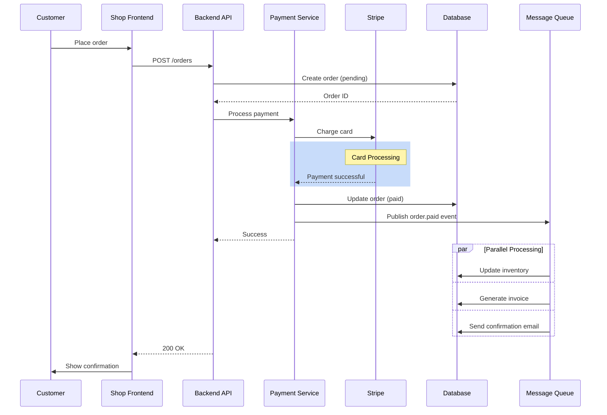
```mermaid
sequenceDiagram
    participant C as Customer
    participant Shop as Shop Frontend
    participant API as Backend API
    participant Payment as Payment Service
    participant Stripe as Stripe
    participant DB as Database
    participant Queue as Message Queue

    C->>Shop: Place order
    Shop->>API: POST /orders
    API->>DB: Create order (pending)
    DB-->>API: Order ID

    API->>Payment: Process payment
    Payment->>Stripe: Charge card

    rect rgb(200, 220, 250)
        Note over Stripe: Card Processing
        Stripe-->>Payment: Payment successful
    end

    Payment->>DB: Update order (paid)
    Payment->>Queue: Publish order.paid event
    Payment-->>API: Success

    par Parallel Processing
        Queue->>DB: Update inventory
    and
        Queue->>DB: Generate invoice
    and
        Queue->>DB: Send confirmation email
    end

    API-->>Shop: 200 OK
    Shop->>C: Show confirmation
```

### Advanced Features

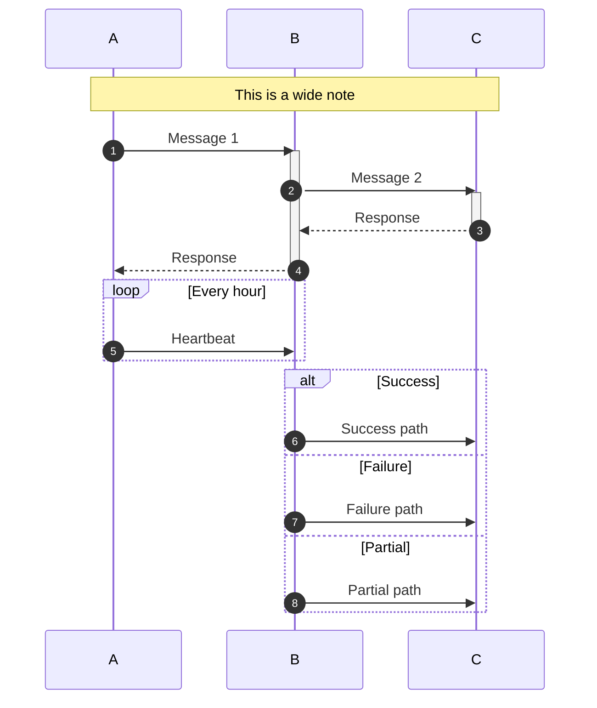
```mermaid
sequenceDiagram
    autonumber
    participant A
    participant B
    participant C

    Note over A,C: This is a wide note

    A->>B: Message 1
    activate B
    B->>C: Message 2
    activate C
    C-->>B: Response
    deactivate C
    B-->>A: Response
    deactivate B

    loop Every hour
        A->>B: Heartbeat
    end

    alt Success
        B->>C: Success path
    else Failure
        B->>C: Failure path
    else Partial
        B->>C: Partial path
    end
```

---

## Class Diagrams

### Basic Syntax

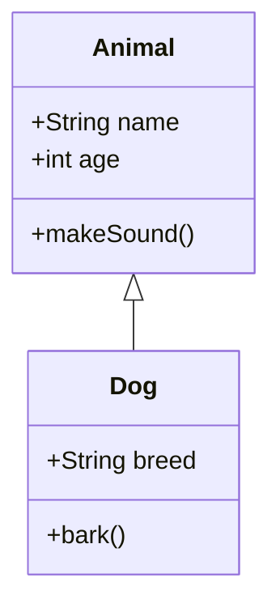
```mermaid
classDiagram
    class Animal {
        +String name
        +int age
        +makeSound()
    }

    class Dog {
        +String breed
        +bark()
    }

    Animal <|-- Dog
```

### Relationships
- `<|--` Inheritance
- `*--` Composition
- `o--` Aggregation
- `-->` Association
- `--` Link
- `..>` Dependency
- `..|>` Realization

### Example: E-Commerce System

```mermaid
classDiagram
    class User {
        +String id
        +String email
        +String name
        +login()
        +logout()
    }

    class Order {
        +String id
        +Date createdAt
        +OrderStatus status
        +Float total
        +addItem()
        +removeItem()
        +checkout()
    }

    class OrderItem {
        +String productId
        +int quantity
        +Float price
        +getSubtotal()
    }

    class Product {
        +String id
        +String name
        +Float price
        +int stock
        +updateStock()
    }

    class Payment {
        +String id
        +PaymentMethod method
        +PaymentStatus status
        +process()
        +refund()
    }

    class Address {
        +String street
        +String city
        +String zipCode
    }

    User "1" --> "*" Order : places
    Order "1" *-- "*" OrderItem : contains
    OrderItem "*" --> "1" Product : references
    Order "1" --> "1" Payment : has
    User "1" --> "*" Address : has
    Order "*" --> "1" Address : ships to

    <<enumeration>> OrderStatus
    OrderStatus : PENDING
    OrderStatus : PAID
    OrderStatus : SHIPPED
    OrderStatus : DELIVERED

    <<enumeration>> PaymentStatus
    PaymentStatus : PENDING
    PaymentStatus : COMPLETED
    PaymentStatus : FAILED
```

---

## State Diagrams

### Basic Syntax

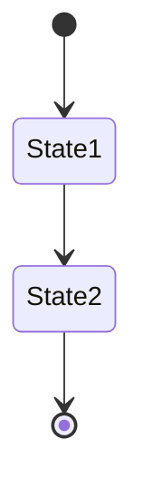
```mermaid
stateDiagram-v2
    [*] --> State1
    State1 --> State2
    State2 --> [*]
```

### Example: Order Lifecycle

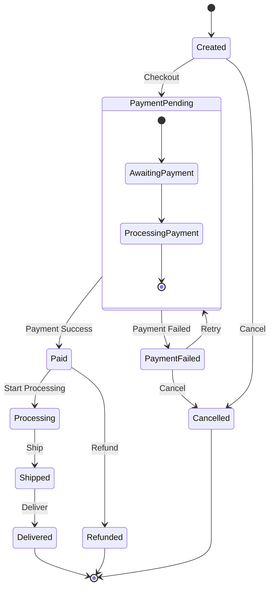
```mermaid
stateDiagram-v2
    [*] --> Created
    Created --> PaymentPending : Checkout
    PaymentPending --> PaymentFailed : Payment Failed
    PaymentPending --> Paid : Payment Success
    PaymentFailed --> Cancelled : Cancel
    PaymentFailed --> PaymentPending : Retry
    Paid --> Processing : Start Processing
    Processing --> Shipped : Ship
    Shipped --> Delivered : Deliver
    Delivered --> [*]

    Created --> Cancelled : Cancel
    Paid --> Refunded : Refund
    Refunded --> [*]
    Cancelled --> [*]

    state PaymentPending {
        [*] --> AwaitingPayment
        AwaitingPayment --> ProcessingPayment
        ProcessingPayment --> [*]
    }
```

### Example: User Session

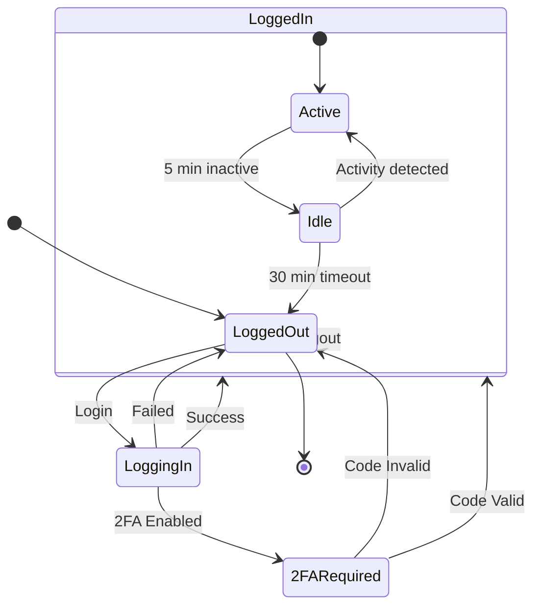
```mermaid
stateDiagram-v2
    [*] --> LoggedOut
    LoggedOut --> LoggingIn : Login
    LoggingIn --> 2FARequired : 2FA Enabled
    LoggingIn --> LoggedIn : Success
    LoggingIn --> LoggedOut : Failed

    2FARequired --> LoggedIn : Code Valid
    2FARequired --> LoggedOut : Code Invalid

    state LoggedIn {
        [*] --> Active
        Active --> Idle : 5 min inactive
        Idle --> Active : Activity detected
        Idle --> LoggedOut : 30 min timeout
    }

    LoggedIn --> LoggedOut : Logout
    LoggedOut --> [*]
```

---

## Entity Relationship Diagrams (ERD)

### Basic Syntax

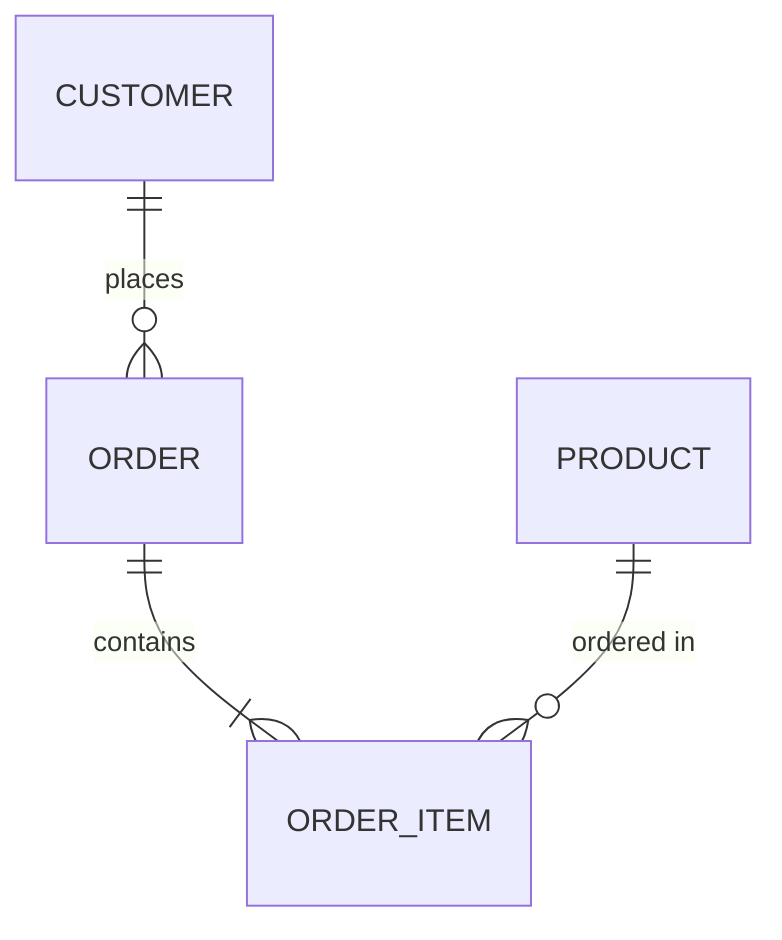
```mermaid
erDiagram
    CUSTOMER ||--o{ ORDER : places
    ORDER ||--|{ ORDER_ITEM : contains
    PRODUCT ||--o{ ORDER_ITEM : "ordered in"
```

### Relationship Types
- `||--||` One to one
- `||--o{` One to many
- `}o--o{` Many to many
- `||--o|` One to zero or one

### Example: Social Media Database

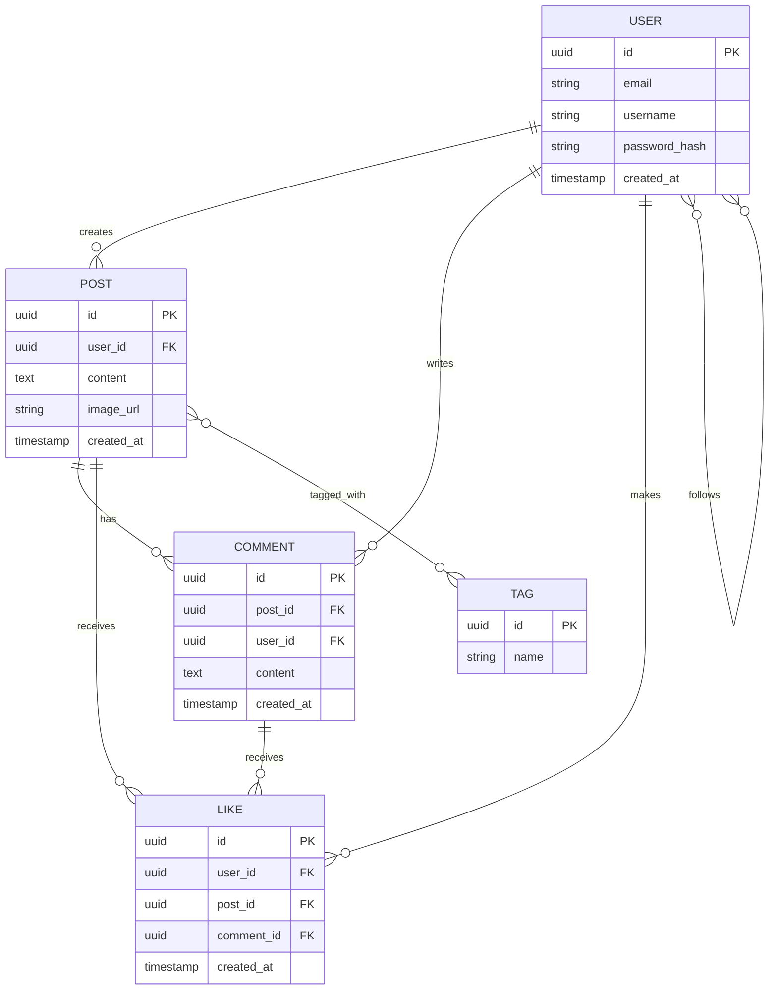
```mermaid
erDiagram
    USER ||--o{ POST : creates
    USER ||--o{ COMMENT : writes
    USER ||--o{ LIKE : makes
    USER }o--o{ USER : follows
    POST ||--o{ COMMENT : has
    POST ||--o{ LIKE : receives
    POST }o--o{ TAG : tagged_with
    COMMENT ||--o{ LIKE : receives

    USER {
        uuid id PK
        string email
        string username
        string password_hash
        timestamp created_at
    }

    POST {
        uuid id PK
        uuid user_id FK
        text content
        string image_url
        timestamp created_at
    }

    COMMENT {
        uuid id PK
        uuid post_id FK
        uuid user_id FK
        text content
        timestamp created_at
    }

    LIKE {
        uuid id PK
        uuid user_id FK
        uuid post_id FK
        uuid comment_id FK
        timestamp created_at
    }

    TAG {
        uuid id PK
        string name
    }
```

---

## Gantt Charts

### Basic Syntax

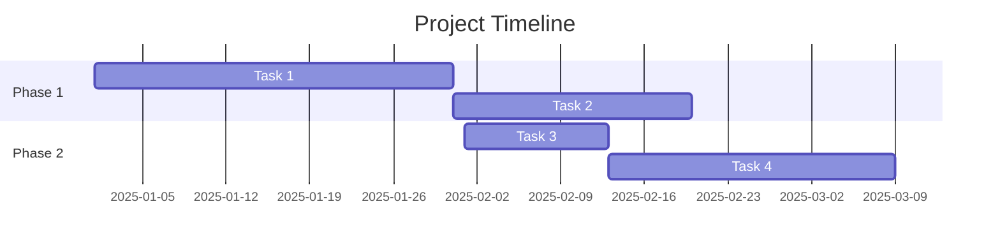
```mermaid
gantt
    title Project Timeline
    dateFormat YYYY-MM-DD
    section Phase 1
    Task 1           :a1, 2025-01-01, 30d
    Task 2           :after a1, 20d
    section Phase 2
    Task 3           :2025-02-01, 12d
    Task 4           :24d
```

### Example: Software Development

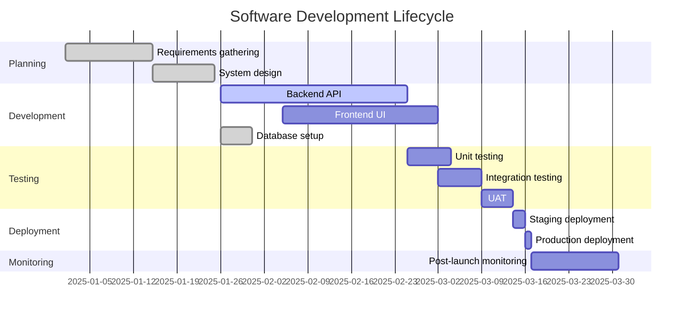
```mermaid
gantt
    title Software Development Lifecycle
    dateFormat YYYY-MM-DD

    section Planning
    Requirements gathering    :done, req, 2025-01-01, 2025-01-15
    System design            :done, design, after req, 10d

    section Development
    Backend API              :active, backend, 2025-01-26, 30d
    Frontend UI              :frontend, 2025-02-05, 25d
    Database setup           :done, db, 2025-01-26, 5d

    section Testing
    Unit testing             :test1, after backend, 7d
    Integration testing      :test2, after frontend, 7d
    UAT                      :uat, after test2, 5d

    section Deployment
    Staging deployment       :deploy1, after uat, 2d
    Production deployment    :deploy2, after deploy1, 1d

    section Monitoring
    Post-launch monitoring   :monitor, after deploy2, 14d
```

---

## Git Graph

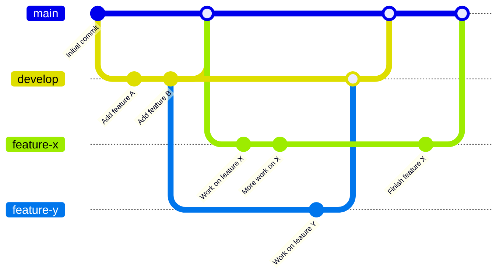
```mermaid
gitGraph
    commit id: "Initial commit"
    branch develop
    checkout develop
    commit id: "Add feature A"
    commit id: "Add feature B"
    checkout main
    merge develop
    branch feature-x
    commit id: "Work on feature X"
    commit id: "More work on X"
    checkout develop
    branch feature-y
    commit id: "Work on feature Y"
    checkout develop
    merge feature-y
    checkout main
    merge develop
    checkout feature-x
    commit id: "Finish feature X"
    checkout main
    merge feature-x
```

---

## Pie and Bar Charts

### Pie Chart

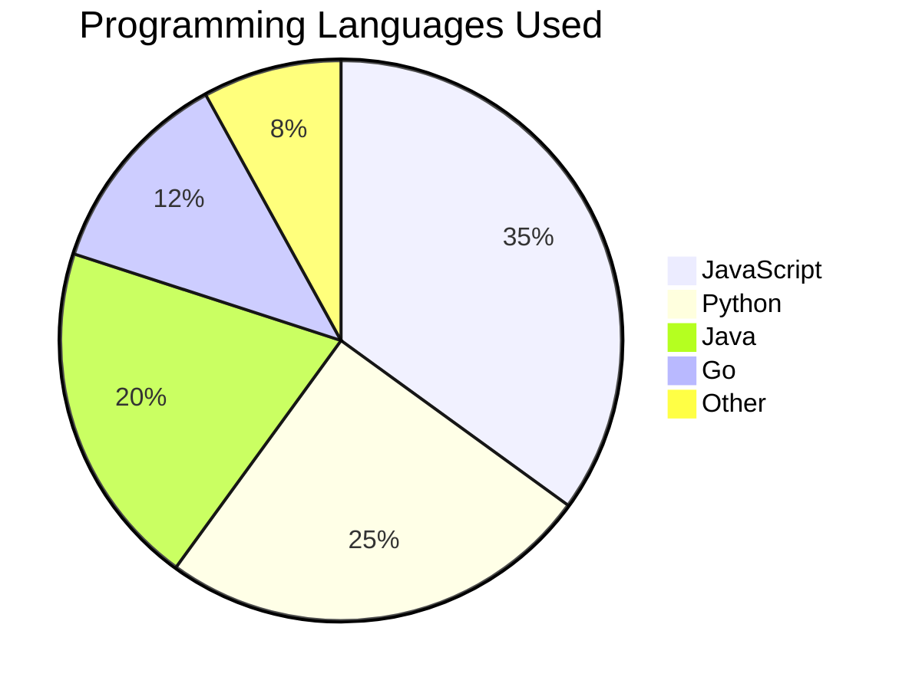
```mermaid
pie title Programming Languages Used
    "JavaScript" : 35
    "Python" : 25
    "Java" : 20
    "Go" : 12
    "Other" : 8
```

### Example: System Resource Usage

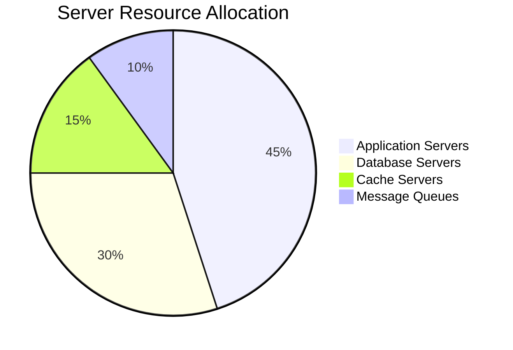
```mermaid
pie title Server Resource Allocation
    "Application Servers" : 45
    "Database Servers" : 30
    "Cache Servers" : 15
    "Message Queues" : 10
```

---

## Mindmap (Experimental)

```mermaid
mindmap
  root((Technical Documentation))
    Design Docs
      Architecture
      API Contracts
      Data Models
    Diagrams
      Flowcharts
      Sequence
      ERD
    Code Examples
      JavaScript
      Python
      cURL
    Best Practices
      Clarity
      Consistency
      Completeness
```

---

## Styling and Themes

### Custom Styles

```mermaid
graph LR
    A[Normal]
    B[Highlighted]
    C[Important]

    style B fill:#ff9,stroke:#333,stroke-width:4px
    style C fill:#f96,stroke:#333,stroke-width:4px
```

### Subgraphs with Styling

```mermaid
graph TB
    subgraph "Frontend"
        A[React App]
        B[Vue App]
    end

    subgraph "Backend"
        C[Node.js API]
        D[Python API]
    end

    subgraph "Database"
        E[(PostgreSQL)]
        F[(MongoDB)]
    end

    A --> C
    B --> D
    C --> E
    D --> F

    style Frontend fill:#e1f5ff
    style Backend fill:#fff3cd
    style Database fill:#d4edda
```

---

## Real-World Examples

### Microservices Architecture

```mermaid
graph TB
    subgraph "Edge Layer"
        CDN[CDN]
        WAF[WAF]
    end

    subgraph "API Gateway"
        KONG[Kong Gateway]
    end

    subgraph "Services"
        AUTH[Auth Service]
        USER[User Service]
        ORDER[Order Service]
        PRODUCT[Product Service]
        PAYMENT[Payment Service]
    end

    subgraph "Data"
        POSTGRES[(PostgreSQL)]
        MONGO[(MongoDB)]
        REDIS[(Redis Cache)]
    end

    subgraph "Message Broker"
        KAFKA[Kafka]
    end

    subgraph "External"
        STRIPE[Stripe API]
        EMAIL[SendGrid]
    end

    CDN --> WAF
    WAF --> KONG
    KONG --> AUTH
    KONG --> USER
    KONG --> ORDER
    KONG --> PRODUCT

    AUTH --> POSTGRES
    USER --> POSTGRES
    ORDER --> POSTGRES
    PRODUCT --> MONGO

    ORDER --> REDIS
    PRODUCT --> REDIS

    ORDER --> KAFKA
    PAYMENT --> KAFKA
    KAFKA --> EMAIL

    PAYMENT --> STRIPE

    style CDN fill:#ff6b6b
    style KONG fill:#ffd93d
    style AUTH fill:#6bcf7f
    style USER fill:#6bcf7f
    style ORDER fill:#6bcf7f
    style PRODUCT fill:#6bcf7f
    style PAYMENT fill:#6bcf7f
    style KAFKA fill:#ff8c42
```

### CI/CD Pipeline

```mermaid
graph LR
    A[Git Push] --> B[GitHub Actions]
    B --> C{Tests Pass?}
    C -->|Yes| D[Build Docker]
    C -->|No| E[Notify Team]
    D --> F[Push to Registry]
    F --> G{Deploy to Staging}
    G -->|Success| H[Run E2E Tests]
    G -->|Fail| E
    H --> I{Tests Pass?}
    I -->|Yes| J{Manual Approval?}
    I -->|No| E
    J -->|Approved| K[Deploy to Prod]
    J -->|Rejected| E
    K --> L[Health Checks]
    L -->|Healthy| M[Complete]
    L -->|Unhealthy| N[Rollback]
    N --> E

    style A fill:#e1f5ff
    style D fill:#fff3cd
    style K fill:#d4edda
    style E fill:#f8d7da
    style M fill:#d4edda
```

### User Registration Flow

```mermaid
sequenceDiagram
    actor U as User
    participant UI as Frontend
    participant API as Backend API
    participant DB as Database
    participant Email as Email Service
    participant Cache as Redis

    U->>UI: Fill registration form
    UI->>UI: Client-side validation
    UI->>API: POST /auth/register

    API->>API: Validate input
    API->>DB: Check email exists

    alt Email already exists
        DB-->>API: Email found
        API-->>UI: 409 Conflict
        UI->>U: Show error
    else Email available
        DB-->>API: Email available
        API->>API: Hash password
        API->>DB: Create user
        DB-->>API: User created

        API->>API: Generate JWT
        API->>Cache: Store session
        Cache-->>API: Session stored

        par Async operations
            API->>Email: Send welcome email
        and
            API->>Email: Send verification email
        end

        API-->>UI: 201 Created + Token
        UI->>UI: Store token
        UI->>U: Redirect to dashboard

        Email-->>U: Welcome & verification emails
    end
```

---

## Tips for Effective Diagrams

### 1. Keep It Simple
- Focus on key components
- Hide implementation details
- Use appropriate abstraction level

### 2. Use Consistent Naming
- Follow naming conventions
- Be descriptive but concise
- Avoid abbreviations unless well-known

### 3. Add Context
- Include titles and captions
- Add notes for complex parts
- Provide legends when needed

### 4. Choose the Right Diagram Type
- **Flowchart:** Processes and decisions
- **Sequence:** Time-based interactions
- **Class:** Object structure
- **ERD:** Data relationships
- **State:** State transitions
- **Gantt:** Timelines

### 5. Use Color Meaningfully
- Group related components
- Highlight critical paths
- Show status (green=good, red=error)

### 6. Layer Information
- Show high-level first
- Add details in sub-diagrams
- Use subgraphs for grouping

---

## Mermaid Export Options

### For Google Docs
1. Use [Mermaid Live Editor](https://mermaid.live/)
2. Export as PNG/SVG
3. Insert image into document

### For Notion
1. Use `/code` block
2. Select "Mermaid" language
3. Paste diagram code (renders automatically)

### For Markdown/GitHub
1. Use fenced code blocks with `mermaid` language
2. GitHub renders automatically
3. For other platforms, use image export

### For Presentations
1. Export as high-resolution PNG
2. Use transparent background
3. Optimize for slide dimensions

---

## Resources

- [Mermaid Official Documentation](https://mermaid.js.org/)
- [Mermaid Live Editor](https://mermaid.live/)
- [Mermaid Chart Examples](https://mermaid.js.org/ecosystem/integrations.html)
